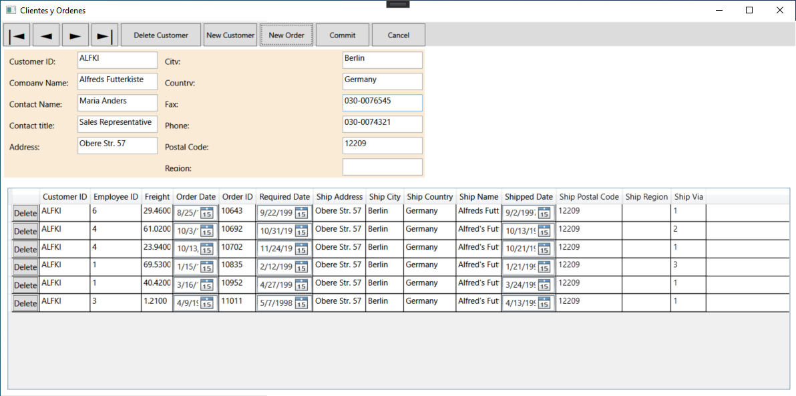
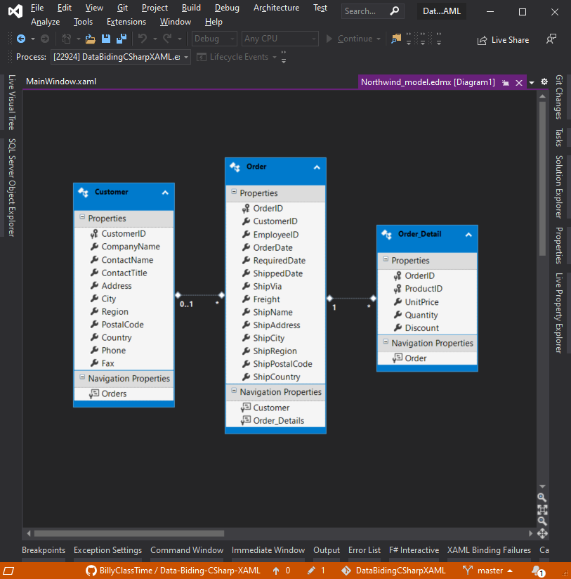
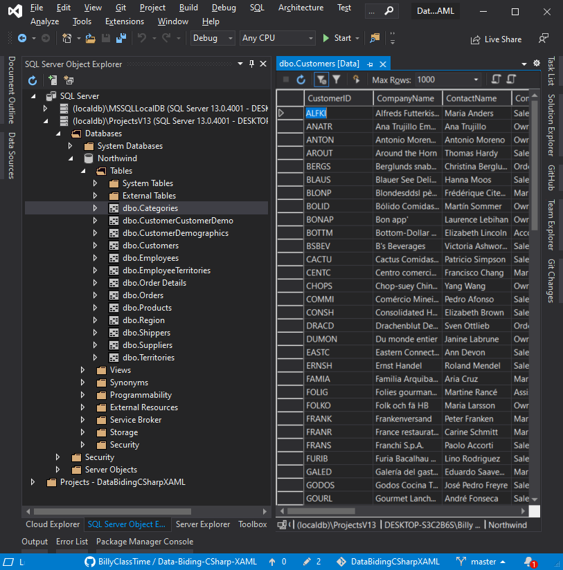

# WPF Enlazando datos desde una BD en XAML

## Entity Design Model

## SQL Server Express Edition (64-bits)

## Crear una aplicación de datos sencilla con WPF y Entity Framework 6

[Tutorial](https://docs.microsoft.com/en-us/visualstudio/data-tools/create-a-simple-data-application-with-wpf-and-entity-framework-6?view=vs-2019)